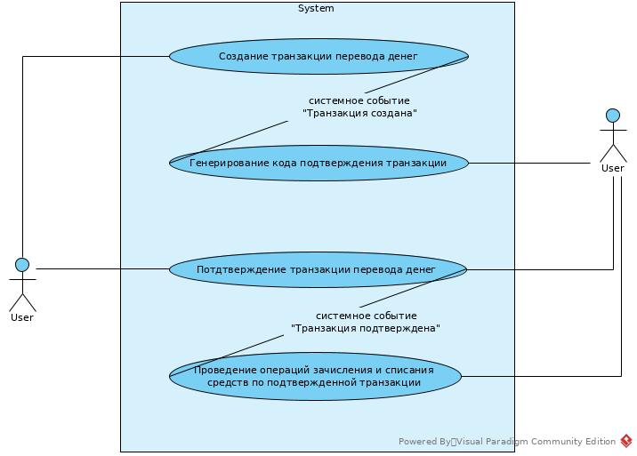
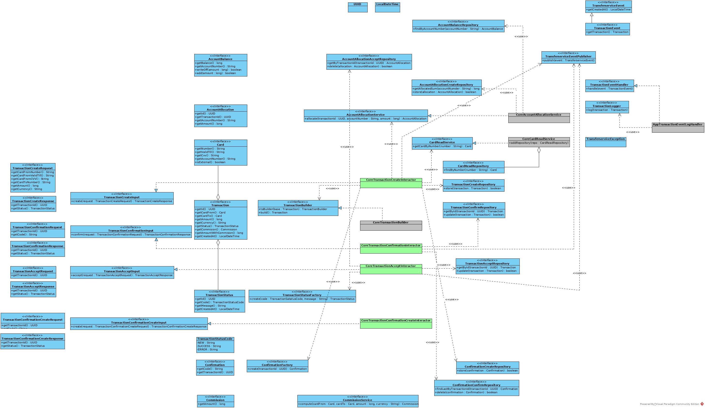

# Курсовой проект «Сервис перевода денег»

<!-- TOC -->
* [Курсовой проект «Сервис перевода денег»](#курсовой-проект-сервис-перевода-денег)
* [Краткое описание проекта](#краткое-описание-проекта)
* [Требования к программному обеспечению](#требования-к-программному-обеспечению)
    * [Зависимости сборки из исходных кодов необходимо](#зависимости-сборки-из-исходных-кодов-необходимо)
* [Сборка из исходных кодов и запуск](#сборка-из-исходных-кодов-и-запуск)
    * [Использование make](#использование-make)
    * [Использование docker compose](#использование-docker-compose)
* [Структура приложения](#структура-приложения)
  * [Логирование изменений состояния транзакций](#логирование-изменений-состояния-транзакций)
  * [Настраевыемые переменные приложения](#настраевыемые-переменные-приложения)
* [Заметки](#заметки)
<!-- TOC -->

# Краткое описание проекта

Необходимо разработать приложение — REST-сервис. Сервис должен предоставить интерфейс для перевода денег с одной карты
на другую по заранее описанной [спецификации](./doc/openapi.yaml).

Заранее подготовленное веб-приложение ([FRONT](https://serp-ya.github.io/card-transfer/)) должно подключаться к
разработанному сервису без доработок и использовать его функционал для перевода денег.

Все требования к проекту описаны в файле [TASK.md](./TASK.md)

Для демонстрации используется карта `1234123412341234`, срок действия `09/55`, cvv `123`. Доступный баланс карты 100000

# Требования к программному обеспечению

* Java 17+ Runtime

### Зависимости сборки из исходных кодов необходимо

* Java 17+ SDK
* Доступ в интернет к репозиторию https://mvnrepository.com/:
    * Spring Boot 3.2.0
    * Lombok 1.18.30
    * Apache commons-csv 1.10.0
    * Mockito junit jupiter 5.7.0 (тестирование)
* Docker 24+ с установленным дополнением compose
* GNU Make 4.3+ (опционально)

# Сборка из исходных кодов и запуск

* Нужно клонировать репозиторий и перейти в корень проекта
* Запустить `JAVA_HOME=/home/a2m/.jdks/temurin-17.0.9 ./mvnw package`, где `/home/a2m/.jdks/temurin-17.0.9` полный путь
  установки исполняемой среды Java 17 на локальной машине.
* Если не возникло ошибок, то в подпапке `./webapp/target` будет создан файл `transferservice-webapp-1.0.0.jar`
* Для запуска приложения следует выполнить команду
  `/home/a2m/.jdks/temurin-17.0.9/bin/java -jar ./webapp/target/transferservice-webapp-1.0.0.jar`
* Приложение развернется локально по адресу `http://locahost:5500`

### Использование make

При наличии установленной утилиты make (OS Linux), доступно использование консольных команд для упрощения некоторых
операций

Предварительно нужно создать .env файл в корне проекта (из .env.example шаблона). В .env файле следует задать нужные
значения переменным окружения.

Доступные команды (см [Makefile](./Makefile)):

* `make clean` - прокси команды maven clean
* `make test-image` - создает тестовый докер образ с тегом test
* `make test` - запускает тестирование проекта, предварительно создав тестовый докер образ с тегом test
* `make test-only` - прокси команды `./mvnw test` (должен быть собран тестовый докер образ проекта)
* `make build` - собирает проект и докер образ с тегом версии и тегом latest
* `make run` - эквивалент
  команды `/home/a2m/.jdks/temurin-17.0.9/bin/java -jar ./webapp/target/transferservice-webapp-1.0.0.jar`

### Использование docker compose

Проект предоставляет файл [docker-compose.yaml](./docker-compose.yaml) для использования приложения совместно с Docker и
Docker compose. Предварительно нужно создать .env файл в корне проекта (из .env.example шаблона). В .env файле следует
задать нужные значения переменным окружения. Также необходимо предварительно собрать jar архив
приложения (`./mvnw package` или `make build`)

Настройки приложения в docker-compose.yaml уже содержат необходимые значения для генерирования демо кодов `0000`
подтверждения транзакций, отправляемые front приложением.

# Структура приложения

Реализуемые приложением сценарии представлены диаграммой

Приложение в версии 1.0.0 реализует 3 сценария из 4х:

1. Создание транзакции перевода денег
2. Генерирование кода подтверждения транзакции
3. Подтверждение транзакции перевода денег

Основываясь [на задании](./TASK.md) и принципе "Чистой архитектуры", описанном
в [Clean Architecture with Spring Boot](https://www.baeldung.com/spring-boot-clean-architecture),
автор разделил приложение на 4е модуля:

* **contracts** - описание интерфейсов предметной области. Содержит стабильные и абстрактные соглашения о сущностях
  проекта. Использует только средства стандартной библиотеки Java 17.
* **core** - состоит из реализаций сущностей предметной области и пользовательских сценариев.
  Как стороннюю зависимость использует библиотеку Lombok.
* **webapp** - реализация rest json сервиса на основе SpringBoot. Содержит финальные реализации алгоритмов хранения и
  преобразования данных, которые зависят от используемого фреймверка. Добавляет логику предварительной валидации
  получаемых пользовательских данных.
* **demo** - финальные реализации репозиториев хранения данных, основанных на Java HashMap классе. Содержит
  демонстрационные данные.

Ниже на диаграмме представлены основные контракты (interface) сущностей, репозиториев, сервисов и сценариев предметной
области, используемых в приложении. Данные контракты описаны в модуле contracts.

## Логирование изменений состояния транзакций

Логирование изменений реализовано через отдельный процесс логера. Процесс запускается при старте spring приложения.
Архитектурно логика логирования реализована по наступлении необходимых событий: транзакция создана, транзакция
подтверждена,
транзакция принята. При наступлении данных событий, они отправляются в очередь и поднятый процесс логера записывает
сведения о транзакции в файл в формате csv.

Имя файла лога может быть установлено переменной окружения `TRANSFERSERVICE_TRANSACTION_LOG_FILENAME`. По-умолчанию
файл находится в `logs/transactions-log.csv` относительно директории приложения (или исходников проекта).

## Настраевыемые переменные приложения

При запуске приложения доступно менять следующие переменные, относящиеся к логике приложения:

| Наименование                                      | По-умолчанию              | Описание                                                                                                                   |
|---------------------------------------------------|---------------------------|----------------------------------------------------------------------------------------------------------------------------|
| TRANSFERSERVICE_TRANSACTION_LOG_FILENAME          | logs/transactions-log.csv | Имя файла лога состояний транзакций                                                                                        |
| TRANSFERSERVICE_TRANSACTION_LOGQUEUE_CAPACITY     | 10000                     | Максимальная длина очереди лога транзакций                                                                                 |
| TRANSFERSERVICE_TRANSACTION_CONFIRMATION_SIZE     | 5                         | Количество символов в коде подтверждения транзакции. Для демо front приложения необходимо указать значение 4               |
| TRANSFERSERVICE_TRANSACTION_CONFIRMATION_TEMPLATE | 0123456789                | Набор символов для кода подтверждения. Для демо front приложение необходимо указать строковое значение из нулей (`000000`) |

# Заметки

* При сборке проекта возникает циклическая зависимость в интеграционных тестах, так как требуется наличие docker образа
  с тегом test, для которого нужно собранное приложение, которое невозможно без прохождения тестов... Текущее решение -
  это сборка проекта с пропуском тестирования (`./mvnw clean package -Dmaven.test.skip`), создание тестового образа и
  затем сборка проекта с тестированием. Как другой возможный вариант - вынесение интеграционных тестов в отдельный
  проект (или модуль), и усложнение процесса релиза: сборка с прохождением юнит тестов, сборка тестового образа,
  прохождение интеграционного тестирования, сборка релиза и docker образа с теггированием.

